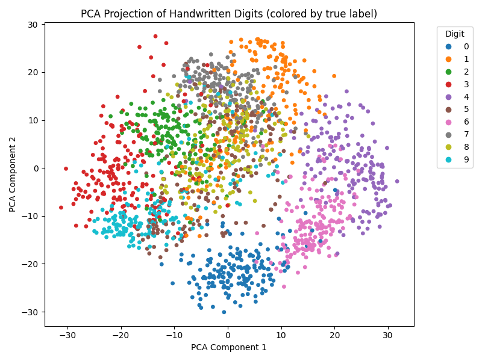
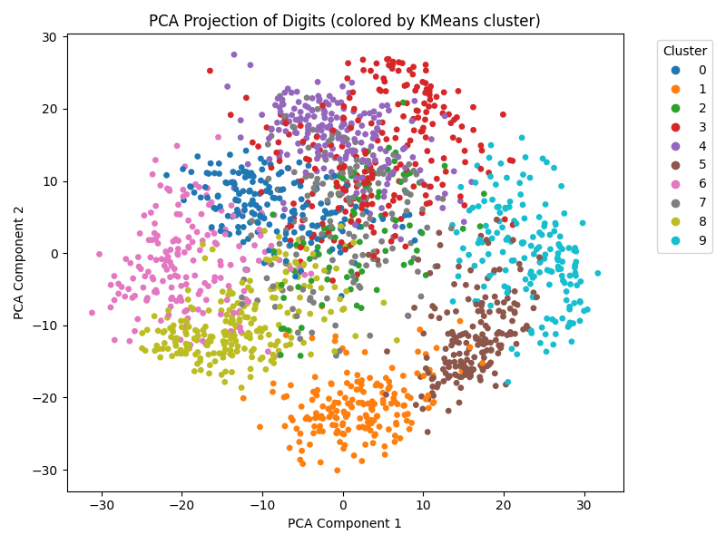
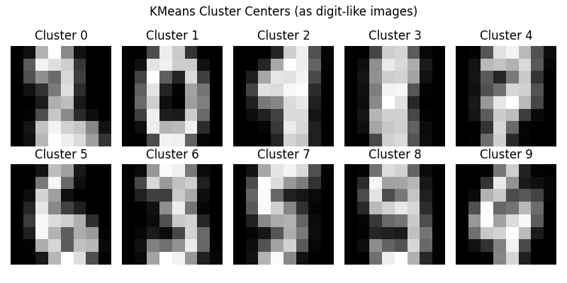

# Digit Clustering with PCA and KMeans (Unsupervised Learning)

This project explores the structure of handwritten digit images using unsupervised learning. Instead of training a model with labels, the goal here was to see how well the digits naturally group together when reduced to two dimensions and clustered. It’s a simple way to show how PCA and KMeans can reveal patterns in image data without any supervised training.

## Overview

The dataset comes from scikit-learn’s `load_digits()` function. Each digit is an 8×8 grayscale image flattened into 64 features. I used PCA to reduce the data down to 2 components so it could be visualized clearly, and then applied KMeans clustering to see how well the algorithm could separate the digits on its own. I also compared the cluster assignments to the true labels using the Adjusted Rand Index (ARI).

## Key Results

- **Adjusted Rand Index (ARI):** ~0.67  
- PCA shows clear separation between digit groups in 2D space  
- KMeans finds meaningful clusters even without labels  
- Cluster centers visualized as 8×8 “average digits” give insight into what each cluster represents

## What This Project Demonstrates

- Working with unsupervised learning techniques  
- Dimensionality reduction using PCA  
- Clustering with KMeans  
- Comparing discovered patterns to real labels  
- Visualizing high-dimensional data in a way that’s easy to interpret  
- Organizing a clean ML workflow using VS Code and a virtual environment  

## Repository Structure
```bash
digit_clustering_pca.py
pca_digits_true_labels.png
pca_digits_cluster_labels.png
kmeans_cluster_centers.png
README.md
requirements.txt
```
## Visual Outputs

### PCA Projection (True Labels)


### PCA Projection (Cluster Labels)


### KMeans Cluster Centers


## How to Run

Activate the same virtual environment used in cv_digit_classifier:

```bash
..\cv_digit_clasifier\venv\Scripts\activate
```
All images will regenerate on each run.

## Tools Used
- Python
- scikit-learn
- NumPy
- Matplotlib
- VS Code
- Virtual environments

## Future Improvements 
- Experiment with different numbers of clustersExperiment with different numbers of clusters
- Try other dimensionality reduction methods (t-SNE, UMAP)
- Compare KMeans to other clustering algorithms like DBSCAN or Spectral Clustering